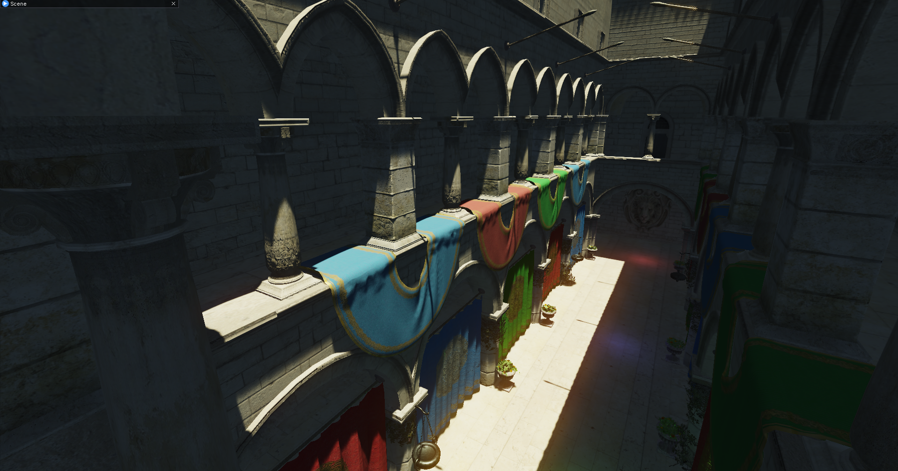
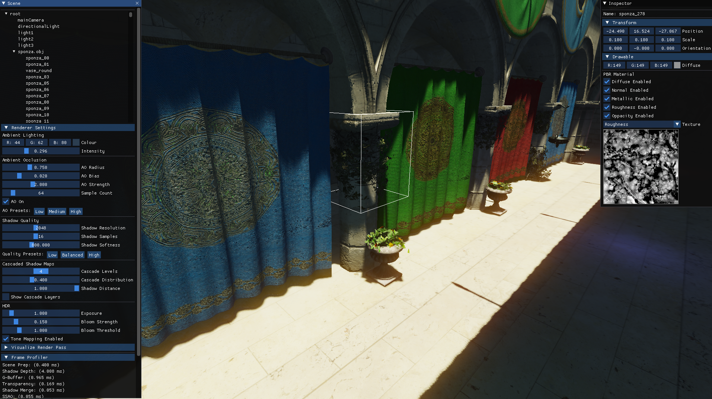

# Fidelity Engine

Fidelity is a modern real-time 3D rendering engine built with OpenGL 4.1 and C++17, designed for Windows and macOS platforms. The engine implements state-of-the-art graphics rendering techniques through a modular, component-based architecture optimized for learning and experimentation with advanced rendering algorithms.

The project focuses on providing an accessible yet powerful framework for implementing cutting-edge graphics techniques, making it ideal for educational purposes, research, and prototype development.

**Current Status**: Under active development - expect ongoing improvements and occasional breaking changes.

## Features

### Rendering Pipeline
- **Physically Based Deferred Rendering**: Modern PBR implementation with metallic-roughness workflow
- **Cascaded Shadow Maps**: High-quality directional light shadows with multiple cascade levels
- **Soft Shadows**: Advanced shadow filtering using Poisson disc sampling and PCF
- **Screen Space Ambient Occlusion (SSAO)**: Enhanced depth-based ambient occlusion
- **HDR Rendering**: High Dynamic Range rendering with exposure control
- **Physically Based Bloom**: Energy-conserving bloom effect for HDR content
- **Tone Mapping**: Multiple tone mapping operators for HDR-to-LDR conversion

### Scene Management
- **Hierarchical Scene Graph**: Efficient spatial organization with transform inheritance
- **Frustum Culling**: Optimized view frustum culling for performance
- **Component-Based Architecture**: Flexible game object composition system
- **Resource Management**: Efficient asset loading and memory management

### Development Tools
- **Real-time Editor UI**: ImGui-based interface for debugging and parameter tuning
- **Performance Profiling**: Built-in timing and statistics collection
- **Shader Hot-Reloading**: Development-time shader recompilation support
- **Multiple Test Applications**: Comprehensive testing and demonstration scenarios

### Supported Platforms
- **Windows**: Primary development platform with Visual Studio support
- **macOS**: Cross-platform compatibility with Xcode support
- **Linux**: Experimental support (community contributions welcome)

## Screenshots



## Building

### Prerequisites
- **CMake 3.21 or higher** - [Download from cmake.org](https://cmake.org/download/)
- **Visual Studio 2019 or later** (on Windows) with C++ development tools
- **Git** for cloning the repository and submodules

### Clone with Submodules
```bash
git clone --recursive https://github.com/your-username/Fidelity.git
cd Fidelity
```

If you already cloned without `--recursive`, initialize submodules:
```bash
git submodule update --init --recursive
```

### Windows Build Instructions

#### Option 1: Using the Build Script (Recommended)
The easiest way to build on Windows is using the provided PowerShell script:

```powershell
# From the project root directory
.\build-windows.ps1
```

This script will:
- Create a `build/release` directory
- Configure CMake with Release settings
- Build all targets
- Copy resources to the output directory

#### Option 2: Manual CMake Build
If you prefer to build manually or need custom configuration:

```powershell
# Create and enter build directory
mkdir build\release
cd build\release

# Configure with CMake
cmake -G "Visual Studio 17 2022" -A x64 -DCMAKE_BUILD_TYPE=Release ..\..

# Build the project
cmake --build . --config Release

# Copy resources (optional, for running examples)
cmake --build . --target copy_resources --config Release
```

### Build Options

The CMake build system supports several configuration options:

- `FIDELITY_ENABLE_WARNINGS` (Default: ON) - Enable comprehensive compiler warnings
- `FIDELITY_BUILD_TESTS` (Default: ON) - Build unit test executables
- `CMAKE_BUILD_TYPE` - Build configuration: Debug, Release, RelWithDebInfo, MinSizeRel

Example with custom options:
```powershell
cmake -G "Visual Studio 17 2022" -A x64 -DCMAKE_BUILD_TYPE=Debug -DFIDELITY_ENABLE_WARNINGS=OFF ..\..
```

### Application Targets

After building, you'll find several executable applications in the `build/release/bin/Release/` directory:

- **Test3D** (`build/release/bin/Release/Test3D.exe`)  
  Basic 3D rendering test with primitive shapes and basic lighting

- **Sponza** (`build/release/bin/Release/Sponza.exe`)  
  Comprehensive scene demonstration featuring the classic Sponza atrium with full PBR pipeline

- **CullingTest** (`build/release/bin/Release/CullingTest.exe`)  
  Frustum culling performance demonstration with large numbers of objects

- **Tests** (`build/release/bin/Release/Tests.exe`)  
  Comprehensive unit test suite for engine mathematics and core systems

All applications include the editor UI for real-time parameter adjustment and debugging.

### Running the Applications

You can run the applications from the project root directory:

```powershell
# Run the Sponza demo (most comprehensive)
.\build\release\bin\Release\Sponza.exe

# Run the basic 3D test
.\build\release\bin\Release\Test3D.exe

# Run the culling performance test
.\build\release\bin\Release\CullingTest.exe

# Run the unit tests
.\build\release\bin\Release\Tests.exe
```

Or navigate to the executable directory and run them directly:

```powershell
cd build\release\bin\Release
.\Sponza.exe
```

**Note**: All required resources (shaders, textures, models, fonts) are automatically copied to the executable directory during the build process, so the applications will find all necessary assets regardless of how they are launched.

### Troubleshooting

**Common Issues and Solutions:**

- **CMake version error**: Ensure CMake 3.21+ is installed and in PATH
- **Missing submodules**: Run `git submodule update --init --recursive` 
- **Visual Studio not found**: Install Visual Studio 2019+ with "C++ CMake tools" workload
- **OpenGL errors**: Update graphics drivers; ensure OpenGL 4.1+ support
- **Build errors**: Try a clean build by deleting `build/` directory and rebuilding
- **Runtime crashes**: Verify all resources are copied; check console for OpenGL errors
- **Poor performance**: Ensure Release build; check GPU compatibility

**Debug Build Performance**: Debug builds include extensive validation and may run significantly slower than Release builds.

## Technical Requirements

### Minimum System Requirements
- **OS**: Windows 10+ or macOS 10.14+
- **Graphics**: OpenGL 4.1 compatible GPU
- **Memory**: 4GB RAM minimum, 8GB recommended
- **Storage**: 2GB available space for full build

### Development Requirements  
- **Compiler**: MSVC 2019+ (Windows) or Clang 10+ (macOS)
- **CMake**: Version 3.21 or higher
- **Git**: For repository and submodule management

## Development Roadmap

### Completed Features ✅
- [x] **Core Rendering Pipeline**: Deferred rendering with G-buffer
- [x] **Physically Based Rendering**: Full PBR material system
- [x] **Shadow System**: Cascaded shadow maps with soft shadows
- [x] **Post-Processing**: SSAO, HDR bloom, tone mapping
- [x] **Scene Management**: Component-based architecture with scene graph
- [x] **Resource Loading**: Model, texture, and shader loading systems

### In Progress 🚧
- [ ] **Octree Spatial Partitioning**: Improved culling and spatial queries
- [ ] **Point Light Shadows**: Omnidirectional shadow mapping
- [ ] **Image Based Lighting**: Environment mapping and reflection probes

### Future Enhancements 🎯
- [ ] **Advanced Lighting**: Clustered forward rendering for many lights
- [ ] **Post-Processing Effects**: Screen-space reflections, motion blur, depth of field
- [ ] **Anti-Aliasing**: FXAA, TAA, and MSAA support  
- [ ] **Volumetric Effects**: Fog, god rays, and atmospheric scattering
- [ ] **Animation System**: Skeletal animation and morphing
- [ ] **Audio Integration**: 3D positional audio system
- [ ] **Physics Integration**: Collision detection and rigid body dynamics
- [ ] **Scripting Support**: Lua or C# scripting interface
- [ ] **Platform Expansion**: Linux native support, mobile platforms

### Performance Optimizations 🚀
- [ ] **GPU-Driven Rendering**: Indirect draw calls and GPU culling
- [ ] **Level-of-Detail**: Automatic LOD generation and management
- [ ] **Texture Streaming**: Dynamic texture loading and compression
- [ ] **Multi-threading**: Parallel command buffer generation

## Architecture Overview

Fidelity Engine follows a modular, component-based architecture designed for extensibility and maintainability. The engine is structured around several key subsystems:

### Core Architecture Components

**Application Layer**: The main application framework handles window management, input processing, and the primary game loop.

**Scene Management**: A hierarchical scene graph system manages game objects, transforms, and spatial relationships.

**Rendering Pipeline**: A deferred rendering pipeline optimized for physically-based rendering (PBR) with multiple render passes.

**Resource Management**: Efficient loading and management of textures, models, shaders, and other assets.

**Mathematics Library**: Custom mathematics implementation for 3D graphics operations.

### Rendering Pipeline

The engine implements a modern deferred rendering pipeline with the following stages:

1. **Geometry Pass**: Renders scene geometry to G-buffer
2. **Shadow Pass**: Generates cascaded shadow maps for directional lights
3. **Lighting Pass**: Performs physically-based lighting calculations
4. **Post-Processing**: Applies SSAO, bloom, tone mapping, and other effects
5. **Forward Pass**: Handles transparent objects and UI elements

### Key Directories Explained

**Source/Engine/**: The heart of the engine, organized by functional domains:
- **Core**: Fundamental engine systems and object lifecycle management
- **Rendering**: High-level rendering abstractions and pipeline management
- **RenderApi**: Low-level graphics API abstraction layer
- **Maths**: Custom mathematics library optimized for graphics operations

**Resources/**: All engine assets organized by type:
- **Shaders**: GLSL shaders implementing the rendering pipeline
- **Models**: 3D assets for testing and demonstration
- **Textures**: Image assets including PBR material textures

**Externals/**: Carefully selected third-party libraries:
- **assimp**: Robust model loading supporting 40+ formats
- **glad**: Modern OpenGL loader with extensions support
- **glfw**: Cross-platform window and input management
- **glm**: Header-only mathematics library for graphics

## Contributing

We welcome contributions! Please see our contributing guidelines for:
- Code style and formatting requirements
- Testing procedures and requirements  
- Documentation standards
- Pull request submission process
  
## References and Acknowledgments

The Fidelity Engine is built upon the collective knowledge of the graphics programming community. The following resources have been instrumental in the development of various engine systems:

### Core Graphics Programming
- [Learn OpenGL](https://learnopengl.com/) - Comprehensive modern OpenGL tutorial series
- [Lighthouse3D Tutorials](http://www.lighthouse3d.com/) - Classic computer graphics tutorials and techniques
- [3D Game Shaders for Beginners](https://github.com/lettier/3d-game-shaders-for-beginners) - Practical shader programming guide

### Performance Analysis and Optimization  
- [Sponza Frame Analysis](https://blogs.igalia.com/itoral/2018/04/17/frame-analysis-of-a-rendering-of-the-sponza-model/) - Detailed analysis of modern rendering pipeline performance

### Culling and Spatial Optimization
- [View Frustum Culling](http://www.lighthouse3d.com/tutorials/view-frustum-culling/) - Mathematical foundations of frustum culling algorithms

### Shadow Mapping Techniques
- [Shadow Mapping](https://alextardif.com/shadowmapping.html) - Comprehensive shadow mapping implementation guide
- [MJP's Shadow Maps](https://therealmjp.github.io/posts/shadow-maps/) - Advanced shadow mapping techniques and optimizations  
- [Microsoft Shadow Depth Maps](https://learn.microsoft.com/en-us/windows/win32/dxtecharts/common-techniques-to-improve-shadow-depth-maps) - Industry best practices for shadow quality

### Screen Space Techniques
- [SSAO Tutorial](http://john-chapman-graphics.blogspot.com/2013/01/ssao-tutorial.html) - Screen-space ambient occlusion implementation details

### Physically Based Rendering
- [Epic Games PBR Notes](https://blog.selfshadow.com/publications/s2013-shading-course/karis/s2013_pbs_epic_notes_v2.pdf) - Real-time PBR implementation in Unreal Engine
- [Physics and Math of Shading](https://blog.selfshadow.com/publications/s2013-shading-course/hoffman/s2013_pbs_physics_math_notes.pdf) - Mathematical foundations of physically based shading

### HDR and Post-Processing
- [HDR Bloom Tutorial](https://web.archive.org/web/20060818101028/http://harkal.sylphis3d.com/2006/05/20/how-to-do-good-bloom-for-hdr-rendering) - High-quality bloom implementation for HDR rendering
- [Catlike Coding Bloom](https://catlikecoding.com/unity/tutorials/advanced-rendering/bloom/) - Step-by-step bloom effect implementation

### Advanced Lighting
- [Clustered Shading](http://www.aortiz.me/2018/12/21/CG.html) - Modern many-light rendering techniques

### Third-Party Libraries
- **GLFW**: Multi-platform library for window management and input
- **GLAD**: OpenGL loader and extension manager  
- **GLM**: Header-only mathematics library for graphics software
- **Assimp**: Comprehensive 3D model loading library
- **ImGui**: Immediate mode GUI for tool development

## License

This project is open source and available under the [MIT License](LICENSE).