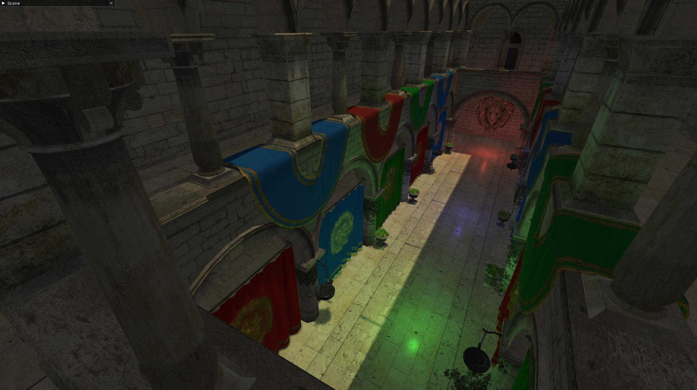

# Fidelity Engine
Fidelity is a real-time 3D rendering engine built in OpenGL 4.1 and written for Windows and OSX. It will probably build for Linux but I have not attempted this yet.
The goal of this project is to implement an easy to use rendering engine to learn the latest graphics rendering techniques and optimization.
It is still under heavy development so expect bugs and performance issues.

## Features
- Deferred Rendering Pipeline
- Cascaded Shadow Maps for Directional Lights
- Screen space ambient occlusion
- Scenegraph with Frustrum Culling
- Editor UI for Debugging

## Screenshots

## Future Work
- [x] Cascaded Shadow Maps for Directional Lights
- [x] Soft Shadows using Poisson disc sampling and PCF
- [x] Screen space ambient occlusion
- [ ] Performance Improvements
- [ ] Point Light Shadow Maps
- [ ] Screen space reflection
- [ ] Motion Blur
- [ ] Depth of Field
- [ ] FXAA
- [ ] HDR Tone Mapping
- [ ] Physically based rendering
- [ ] Clustered Shading 

## References
#### General
* https://learnopengl.com/
* https://blogs.igalia.com/itoral/2018/04/17/frame-analysis-of-a-rendering-of-the-sponza-model/
#### Shadow Mapping
* https://alextardif.com/shadowmapping.html
* https://therealmjp.github.io/posts/shadow-maps/
* https://learn.microsoft.com/en-us/windows/win32/dxtecharts/common-techniques-to-improve-shadow-depth-maps
#### Clustered Shading
* http://www.aortiz.me/2018/12/21/CG.html
