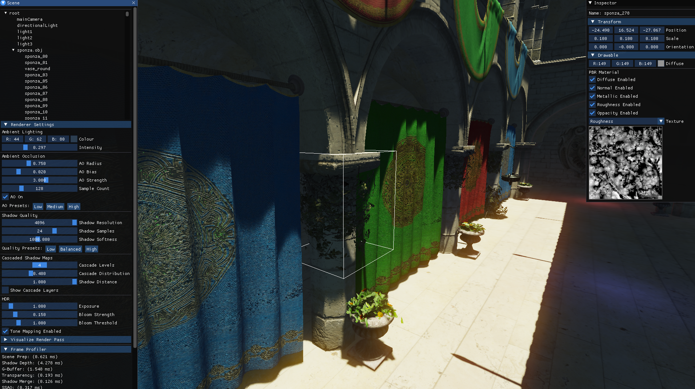

# Fidelity Engine
Fidelity is a real-time 3D rendering engine built in OpenGL 4.1 and written for Windows and OSX. It will probably build for Linux but I have not attempted this yet.
The goal of this project is to implement an easy to use rendering engine to learn the latest graphics rendering techniques and optimization.
It is still under heavy development so expect bugs and performance issues.

## Features
- Physically Based Deferred Rendering Pipeline
- Cascaded Shadow Maps for Directional Lights
- Soft Shadows using Poisson disc sampling and PCF
- Screen space ambient occlusion
- HDR with Physically Based Bloom
- Scenegraph with Frustrum Culling
- Editor UI for Debugging

## Screenshots



## Building

### Prerequisites
- **CMake 3.21 or higher** - [Download from cmake.org](https://cmake.org/download/)
- **Visual Studio 2019 or later** (on Windows) with C++ development tools
- **Git** for cloning the repository and submodules

### Clone with Submodules
```bash
git clone --recursive https://github.com/your-username/Fidelity.git
cd Fidelity
```

If you already cloned without `--recursive`, initialize submodules:
```bash
git submodule update --init --recursive
```

### Windows Build Instructions

#### Option 1: Using the Build Script (Recommended)
The easiest way to build on Windows is using the provided PowerShell script:

```powershell
# From the project root directory
.\build-windows.ps1
```

This script will:
- Create a `build/release` directory
- Configure CMake with Release settings
- Build all targets
- Copy resources to the output directory

#### Option 2: Manual CMake Build
If you prefer to build manually or need custom configuration:

```powershell
# Create and enter build directory
mkdir build\release
cd build\release

# Configure with CMake
cmake -G "Visual Studio 17 2022" -A x64 -DCMAKE_BUILD_TYPE=Release ..\..

# Build the project
cmake --build . --config Release

# Copy resources (optional, for running examples)
cmake --build . --target copy_resources --config Release
```

### Build Options
The CMake build system supports several options:

- `FIDELITY_ENABLE_WARNINGS` (ON by default) - Enable compiler warnings
- `FIDELITY_BUILD_TESTS` (ON by default) - Build test executables
- `CMAKE_BUILD_TYPE` - Build configuration (Debug/Release/RelWithDebInfo)

Example with custom options:
```powershell
cmake -G "Visual Studio 17 2022" -A x64 -DCMAKE_BUILD_TYPE=Debug -DFIDELITY_ENABLE_WARNINGS=OFF ..\..
```

### Running the Examples
After building, you can find the executable files in:
- `build/release/Source/Test3D/Release/Test3D.exe` - Basic 3D test application
- `build/release/Source/Sponza/Release/Sponza.exe` - Sponza scene demo
- `build/release/Source/CullingTest/Release/CullingTest.exe` - Frustum culling test

The build script automatically copies resources, so the examples should run directly.

### Troubleshooting
- **CMake version error**: Ensure you have CMake 3.21 or higher installed
- **Missing submodules**: Run `git submodule update --init --recursive`
- **Visual Studio not found**: Install Visual Studio with C++ development tools
- **Build errors**: Check that all prerequisites are installed and try a clean build

For more details on the modernized build system, see [CMAKE_MODERNIZATION.md](CMAKE_MODERNIZATION.md).

## Future Work
- [x] Cascaded Shadow Maps for Directional Lights
- [x] Soft Shadows using Poisson disc sampling and PCF
- [x] Screen space ambient occlusion
- [x] HDR Tone Mapping
- [x] Physically based rendering
- [x] Bloom
- [ ] Octree Culling
- [ ] Point Light Shadow Maps
- [ ] Image Based Lighting
- [ ] Screen space reflection
- [ ] Motion Blur
- [ ] Depth of Field
- [ ] FXAA
- [ ] Clustered Shading 


## References
#### General
* https://learnopengl.com/
* https://blogs.igalia.com/itoral/2018/04/17/frame-analysis-of-a-rendering-of-the-sponza-model/
* https://github.com/lettier/3d-game-shaders-for-beginners
#### Frustrum Culling
* http://www.lighthouse3d.com/tutorials/view-frustum-culling/
#### Shadow Mapping
* https://alextardif.com/shadowmapping.html
* https://therealmjp.github.io/posts/shadow-maps/
* https://learn.microsoft.com/en-us/windows/win32/dxtecharts/common-techniques-to-improve-shadow-depth-maps
#### Screen Space Ambient Occlusion
* http://john-chapman-graphics.blogspot.com/2013/01/ssao-tutorial.html
#### Physically Based Shading
* https://blog.selfshadow.com/publications/s2013-shading-course/karis/s2013_pbs_epic_notes_v2.pdf
* https://blog.selfshadow.com/publications/s2013-shading-course/hoffman/s2013_pbs_physics_math_notes.pdf
* https://web.archive.org/web/20060818101028/http://harkal.sylphis3d.com/2006/05/20/how-to-do-good-bloom-for-hdr-rendering
#### Bloom
* https://catlikecoding.com/unity/tutorials/advanced-rendering/bloom/
#### Clustered Shading
* http://www.aortiz.me/2018/12/21/CG.html
